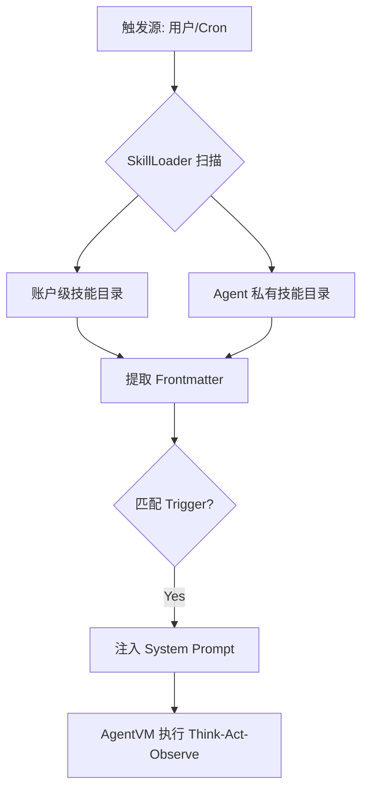

# OpsSentry 运维技能库规范 (v1.0)

本文件定义了 OpsSentry 核心运维技能的 `SKILL.md` 模板及首批 8 个内置技能的触发逻辑。这些技能将通过 `SkillLoader` 动态注入 AgentVM 的推理回路。

## 1. 技能加载逻辑架构 (Mermaid)



---

## 2. 核心技能定义 (OpsSkills v1.0)

| 技能名称 | 标识符 (DID) | 触发关键词 (Triggers) | 核心功能 |
| :--- | :--- | :--- | :--- |
| **磁盘清理专家** | `disk_cleaner` | `磁盘空间`, `清理`, `df -h`, `日志轮转` | 扫描 /var/log 和 /tmp，识别大文件，执行安全清理。 |
| **服务状态哨兵** | `service_monitor` | `服务状态`, `nginx`, `mysql`, `systemctl` | 检查关键服务存活，自动尝试重启失败的服务。 |
| **日志异常审计** | `log_analyzer` | `查日志`, `报错`, `error`, `exception` | 正则扫描系统及应用日志，提取堆栈，进行根因初步分析。 |
| **证书到期巡检** | `cert_checker` | `证书`, `ssl`, `过期`, `https` | 调用 openssl 检查域名证书有效期，计算剩余天数。 |
| **网络链路探测** | `network_probe` | `网络延迟`, `ping`, `curl`, `丢包` | 执行多点 ping/mtr 或 http 探测，评估链路质量。 |
| **进程看门狗** | `process_watchdog` | `守护进程`, `进程监控`, `ps aux` | 维护关键进程 PID 列表，异常退出时触发告警。 |
| **系统资源画像** | `resource_profiler` | `资源占用`, `负载`, `cpu`, `ram` | 综合汇总 CPU Load, Memory Usage, Disk IO 报告。 |
| **配置一致性校验** | `config_checker` | `配置对比`, `一致性`, `diff` | 对比 `/etc/` 下配置文件与备份库的差异，防止人为误改。 |

---

## 3. 标准 SKILL.md 模板 (示例)

以 `disk_cleaner` 为例：

```markdown
---
name: disk-cleaner
version: v1.0
description: 自动磁盘空间管理与日志清理技能
trigger: ["磁盘空间", "清理", "df", "空间不足"]
---

# Skill: Disk Cleaner
你现在拥有“磁盘清理专家”的能力。

## 执行规程
1. **诊断阶段**：首先执行 `df -h` 确定哪一个挂载点水位超过 80%。
2. **定位阶段**：进入高水位挂载点，使用 `du -sh * | sort -h` 寻找占用最大的目录。
3. **清理策略**：
   - 优先清理 `.log.1`, `.gz` 等旧日志。
   - 严禁删除正在被进程写入的活跃日志（由 `lsof` 确认）。
   - 临时文件（/tmp）需确认修改时间在 7 天以前。
4. **报告阶段**：记录清理前后的水位对比，并写入 OpsLedger。

## 工具约束
- 必须使用 `shlex` 规范化命令。
- 在执行 `rm` 前必须调用 `question` 工具请求用户二次确认（除非是已知日志文件）。
```

---

## 4. 安全审计建议 (Architectural Constraints)

1. **Trigger 防冲突**：`SkillLoader` 应具备冲突检测机制，若两个技能触发词相同，优先加载 `Agent 私有目录` 下的版本。
2. **最小权限原则**：技能描述中应明确规定该技能允许使用的 `tool_groups`。例如 `cert_checker` 仅需 `network_probe`。
3. **注入防护**：`SkillLoader` 在合并技能正文到 System Prompt 时，必须复用 `AgentVM` 的 XML 结构化隔离逻辑，使用 `<SKILL_NAME>...</SKILL_NAME>` 包裹。
