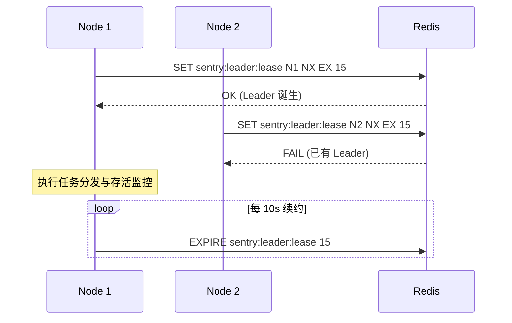
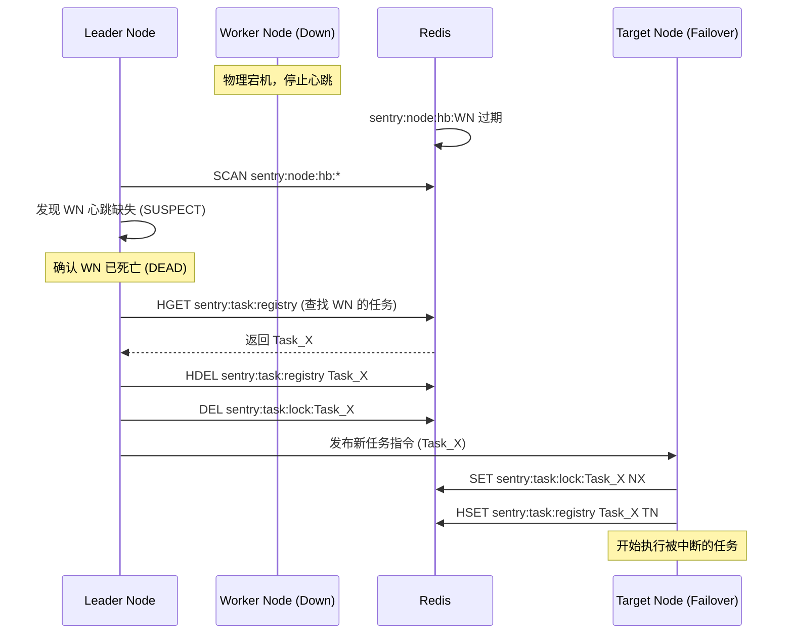

# Phase 7: Redis Schema & Failover Sequence Specification (#63)

## 1. Redis Key Schema 设计

为确保集群状态的一致性与可预测性，所有 Redis Key 均使用 `sentry:` 前缀。

| Key 模式 | 类型 | TTL | 说明 |
| :--- | :--- | :--- | :--- |
| `sentry:cluster:nodes` | Hash | 无 | 存储所有注册节点的元数据 `{node_id: json_metadata}` |
| `sentry:node:hb:{node_id}` | String | 30s | 节点心跳。TTL 失效则触发 SUSPECT 判定 |
| `sentry:leader:lease` | String | 15s | 集群 Leader 租约。只有持有该 Key 的节点可执行任务分发与故障转移 |
| `sentry:task:lock:{task_id}` | String | 任务时长 | 分布式任务执行锁，防止同一任务被多个节点抢占 |
| `sentry:task:registry` | Hash | 无 | 记录当前活跃任务及其执行节点 `{task_id: node_id}` |
| `sentry:msg:broadcast` | Pub/Sub | - | 集群广播通道，用于发布配置变更或即时指令 |

## 2. 核心交互序列图 (Sequence Diagrams)

### 2.1 领导者选举 (Leader Election)
多个节点竞争 Leader 角色，确保集群内只有一个“指挥官”。

### 2.2 故障自动转移 (Failover)
当执行节点宕机时，Leader 识别并重新分配任务。

## 3. 容错细节 (Fault Tolerance Details)

*   **脑裂防护**: 节点在操作 Redis 前必须校验自己是否仍持有 `sentry:leader:lease`。如果由于 GC 停顿或网络抖动导致租约失效，节点必须立即停止所有管理动作。
*   **优雅停机**: 节点正常退出时，应主动调用 `DEL sentry:node:hb:{node_id}` 并将 `sentry:task:registry` 中属于自己的任务清理，触发即时重分配。
*   **隔离恢复 (Anti-Entropy)**: Leader 节点每 5 分钟执行一次全量同步，通过 `HGETALL sentry:task:registry` 与实际 Redis 锁进行对齐，清理因意外崩溃残留的死锁。

## 4. 后续任务分配建议
*   **Developer**: 请根据上述 Schema 扩展 `src/config_shield.py` 的分布式锁实现，支持 Redis 后端。
*   **Tech Lead**: 请在心跳协议设计中，包含 `node_id` 与 `current_load` 等指标。
