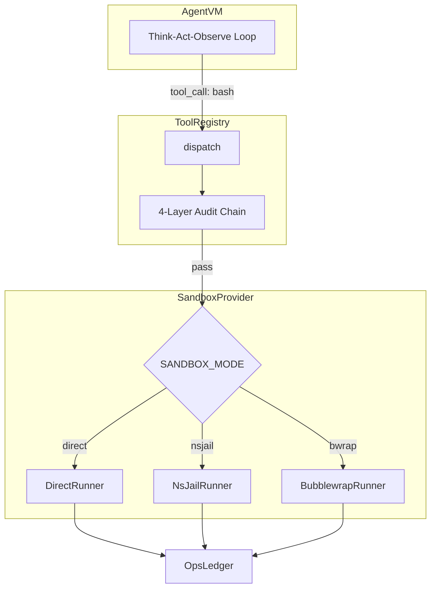

# SandboxProvider 细化设计规格书

> **文档版本**：v1.0 | **最后更新**：2026-03-31
> **作者**：Architect (系统架构师)
> **依赖**：SDD v2.1 §3.10、PRD v2.1 §2.5
> **环境约束**：本地无 Docker，镜像由 GitHub Actions CI 构建，本地通过 `scripts/` 脚本测试

---

## 1. 设计目标

为 `ToolRegistry` 的 `command_execution` 工具组（`bash` / `process`）提供统一的命令执行抽象层，实现：

1. **开发环境**：`DirectRunner` 无强隔离，仅做超时 + 白名单 + 审计日志
2. **CI 环境**：GitHub Actions 中以 `DirectRunner` 运行测试（无 nsjail/bwrap）
3. **生产环境（Docker 容器内）**：`NsJailRunner` 真正 OS 级隔离，`BubblewrapRunner` 作为 fallback

---

## 2. 架构关系图



---

## 3. 模块接口定义（`src/sandbox.py`）

### 3.1 抽象基类

```python
from __future__ import annotations

import abc
from dataclasses import dataclass, field
from typing import Any

@dataclass(slots=True)
class SandboxResult:
    """沙箱命令执行结果"""
    exit_code: int
    stdout: str
    stderr: str
    duration_ms: int
    truncated: bool = False          # stdout 是否被截断
    sandbox_mode: str = "direct"     # 实际使用的 Runner 类型

    def to_audit_record(self) -> dict[str, Any]:
        """输出 OpsLedger 审计记录"""
        return {
            "type": "sandbox_exec",
            "sandbox_mode": self.sandbox_mode,
            "exit_code": self.exit_code,
            "duration_ms": self.duration_ms,
            "stdout_truncated": self.truncated,
        }


class SandboxProvider(abc.ABC):
    """沙箱执行器抽象基类"""

    @abc.abstractmethod
    async def execute(
        self,
        command: str,
        *,
        timeout_seconds: int = 30,
        workdir: str | None = None,
        env: dict[str, str] | None = None,
        network: bool = False,
    ) -> SandboxResult:
        """
        执行 Shell 命令并返回结果。

        Parameters
        ----------
        command : str
            要执行的 Shell 命令字符串
        timeout_seconds : int
            最大执行时长（秒），超时后 kill 进程
        workdir : str | None
            工作目录，None 时使用默认
        env : dict[str, str] | None
            额外环境变量（合并到白名单之上）
        network : bool
            是否允许网络访问（NsJailRunner 默认 False）
        """
        ...

    @abc.abstractmethod
    def mode_name(self) -> str:
        """返回当前 Runner 名称（"direct" | "nsjail" | "bwrap"）"""
        ...
```

### 3.2 DirectRunner（本地开发 / CI 测试）

```python
class DirectRunner(SandboxProvider):
    """
    无强隔离的命令执行器。
    使用 asyncio.create_subprocess_shell 执行命令。

    安全措施（软限制）：
    - 超时 kill（SIGTERM → 2s → SIGKILL）
    - stdout 截断（默认 1MB）
    - stderr 截断（默认 256KB）
    - 执行结果写回 OpsLedger
    """

    MAX_STDOUT_BYTES: int = 1_048_576    # 1 MB
    MAX_STDERR_BYTES: int = 262_144      # 256 KB

    def __init__(self, *, default_workdir: str | None = None):
        self._default_workdir = default_workdir

    async def execute(self, command, *, timeout_seconds=30, workdir=None, env=None, network=False) -> SandboxResult:
        # 实现要点：
        # 1. asyncio.create_subprocess_shell(command, ...)
        # 2. asyncio.wait_for(proc.communicate(), timeout=timeout_seconds)
        # 3. 超时时 proc.terminate() → sleep(2) → proc.kill()
        # 4. stdout/stderr 截断到 MAX_*_BYTES
        # 5. 计算 duration_ms
        # 6. 返回 SandboxResult(sandbox_mode="direct", ...)
        ...

    def mode_name(self) -> str:
        return "direct"
```

### 3.3 NsJailRunner（生产默认）

```python
class NsJailRunner(SandboxProvider):
    """
    基于 nsjail 的 OS 级隔离执行器。
    仅在 Linux 生产环境（Docker 容器内）可用。

    隔离能力：
    - PID / Mount / Net namespace
    - cgroup 资源限制
    - Seccomp syscall 白名单
    - 只读根文件系统
    - nobody 用户执行
    """

    NSJAIL_BIN: str = "/usr/bin/nsjail"

    def __init__(
        self,
        *,
        config_path: str = "config/nsjail-default.cfg",
        seccomp_path: str = "config/seccomp-default.json",
        writable_mounts: list[str] | None = None,
    ):
        self._config_path = config_path
        self._seccomp_path = seccomp_path
        self._writable_mounts = writable_mounts or [
            "/tmp/opssentry-work",
            "/root/.accio/sessions",
            "/opt/opssentry/data/ops-queue",
        ]

    async def execute(self, command, *, timeout_seconds=30, workdir=None, env=None, network=False) -> SandboxResult:
        # 实现要点：
        # 1. 构建 nsjail 命令行参数
        # 2. --time_limit {timeout_seconds}
        # 3. --disable_clone_newnet (如果 network=True)
        # 4. --seccomp_string / --seccomp_policy_file
        # 5. --bindmount_ro / --bindmount 挂载白名单目录
        # 6. --user nobody --group nogroup
        # 7. asyncio.create_subprocess_exec(NSJAIL_BIN, *args)
        # 8. 解析 nsjail 退出码和输出
        ...

    def mode_name(self) -> str:
        return "nsjail"
```

### 3.4 BubblewrapRunner（Fallback）

```python
class BubblewrapRunner(SandboxProvider):
    """
    基于 bubblewrap (bwrap) 的轻量隔离执行器。
    当 nsjail 不可用时的 fallback 方案。

    隔离能力：
    - 文件系统只读挂载
    - 可见目录白名单
    - PID namespace (--unshare-pid)
    """

    BWRAP_BIN: str = "/usr/bin/bwrap"

    async def execute(self, command, *, timeout_seconds=30, workdir=None, env=None, network=False) -> SandboxResult:
        # 实现要点：
        # 1. bwrap --ro-bind / /
        # 2. --bind {writable_dir} {writable_dir} 按需挂载
        # 3. --unshare-pid --unshare-net (if not network)
        # 4. --die-with-parent
        # 5. 超时用 asyncio.wait_for
        ...

    def mode_name(self) -> str:
        return "bwrap"
```

---

## 4. 工厂函数与模式切换

```python
import os
import shutil

def create_sandbox_provider(
    *,
    mode: str | None = None,
    default_workdir: str | None = None,
) -> SandboxProvider:
    """
    根据 SANDBOX_MODE 环境变量或显式参数创建对应的 Runner。

    优先级：
    1. 函数参数 mode
    2. 环境变量 SANDBOX_MODE
    3. 自动检测（有 nsjail → nsjail；有 bwrap → bwrap；否则 direct）

    本地开发 / CI 环境：自动 fallback 到 DirectRunner
    """
    effective_mode = mode or os.environ.get("SANDBOX_MODE", "").lower()

    if effective_mode == "nsjail":
        return NsJailRunner()
    elif effective_mode == "bwrap":
        return BubblewrapRunner()
    elif effective_mode == "direct":
        return DirectRunner(default_workdir=default_workdir)
    else:
        # 自动检测
        if shutil.which("nsjail"):
            return NsJailRunner()
        elif shutil.which("bwrap"):
            return BubblewrapRunner()
        else:
            return DirectRunner(default_workdir=default_workdir)
```

---

## 5. ToolRegistry 集成点

```python
# src/tool_registry.py 中的关键集成逻辑（伪代码）

class ToolRegistry:
    def __init__(self, sandbox: SandboxProvider, ops_ledger: OpsLedger, ...):
        self._sandbox = sandbox
        self._ledger = ops_ledger

    async def dispatch(self, tool_name: str, args: dict) -> dict:
        # === L1: 注册校验 ===
        if tool_name not in self._registered_tools:
            raise ToolNotRegistered(tool_name)

        # === L2: 能力白名单 ===
        if not self._is_tool_enabled(tool_name):
            raise ToolDisabled(tool_name)

        # === L3: Policy 正则 ===
        if tool_name in ("bash", "process"):
            command = args.get("command", "")
            policy_result = self._evaluate_policy(command)
            if policy_result.effect == "deny":
                return {"error": policy_result.reason, "blocked": True}
            if policy_result.effect == "require_approval":
                # 挂起至 OpsLedger，等待管理员审批
                entry = self._ledger.create_entry(
                    action="approval_required",
                    metadata={"command": command, "reason": policy_result.reason},
                )
                return {"pending_approval": entry.id, "reason": policy_result.reason}

        # === L4: 执行 ===
        if tool_name == "bash":
            result = await self._sandbox.execute(
                command=args["command"],
                timeout_seconds=args.get("timeout", 30),
                workdir=args.get("workdir"),
            )
            # 审计写回 OpsLedger
            audit = result.to_audit_record()
            audit["command"] = args["command"]
            audit["ts"] = int(time.time() * 1000)
            self._ledger.create_entry(
                action="sandbox_exec",
                metadata=audit,
            )
            # L4 后置审计：检测 permission denied 等
            if "permission denied" in result.stderr.lower():
                return {"error": "Permission denied detected", "exit_code": result.exit_code}
            return {
                "stdout": result.stdout,
                "stderr": result.stderr,
                "exit_code": result.exit_code,
                "duration_ms": result.duration_ms,
            }

        # 其他工具走正常分发（不经沙箱）
        return await self._dispatch_other(tool_name, args)
```

### 5.1 Policy 评估逻辑（关键细节）

```python
@dataclass
class PolicyResult:
    effect: str   # "allow" | "deny" | "require_approval"
    reason: str

def _evaluate_policy(self, command: str) -> PolicyResult:
    """
    规则评估顺序（SDD §3.3 约定）：
    1. 先遍历所有 L1 deny 规则 → 命中任一则立即 deny
    2. 再遍历 L2 allow 规则 → 命中则放行，跳过 L3
    3. 最后遍历 L3 require_approval → 命中则挂起

    注意：L1 优先级最高，不能被 L2 allow 覆盖
    """
    # Phase 1: L1 deny scan
    for rule in self._policies:
        if rule["level"] == "L1" and rule["effect"] == "deny":
            regex = rule["match"].get("command_regex", "")
            if regex and re.search(regex, command):
                return PolicyResult(effect="deny", reason=rule["reason"])

    # Phase 2: L2 allow scan (角色 + 路径前缀)
    for rule in self._policies:
        if rule["level"] == "L2" and rule["effect"] == "allow":
            # node_role + path_prefix 匹配逻辑
            # 当前简化：本地开发不区分 node_role
            pass

    # Phase 3: L3 require_approval scan
    for rule in self._policies:
        if rule["level"] == "L3" and rule["effect"] == "require_approval":
            path_regex = rule["match"].get("path_regex", "")
            if path_regex and re.search(path_regex, command):
                return PolicyResult(effect="require_approval", reason=rule["reason"])

    return PolicyResult(effect="allow", reason="no policy matched")
```

---

## 6. 环境一致性保障（本地 vs CI vs 生产）

| 维度 | 本地开发 (Windows) | CI (GitHub Actions Ubuntu) | 生产 (Docker Linux) |
|---|---|---|---|
| `SANDBOX_MODE` | `direct`（默认自动） | `direct`（显式设置） | `nsjail`（显式设置） |
| Runner | `DirectRunner` | `DirectRunner` | `NsJailRunner` / `BubblewrapRunner` |
| nsjail 可用 | ❌ | ❌ | ✅（Dockerfile 安装） |
| bwrap 可用 | ❌ | ❌（可选安装） | ✅（Dockerfile 安装） |
| 测试方式 | `scripts/test_runner.ps1` | `pytest` in workflow | 容器内 `pytest` |
| Seccomp | 不适用 | 不适用 | `config/seccomp-default.json` |
| Policy 审计 | ✅（全链路可测） | ✅（全链路可测） | ✅ |

### 6.1 关键设计决策

**Q: 本地 Windows 开发环境无 nsjail/bwrap，如何保证代码质量？**

**A:** 分层测试策略——

1. **单元测试**（本地 + CI）：
   - `DirectRunner` 全功能测试：超时、截断、审计日志
   - `ToolRegistry` 四层审计链测试：Policy 正则匹配、deny/allow/require_approval 逻辑
   - `SandboxProvider` 接口契约测试：Mock `NsJailRunner` / `BubblewrapRunner`

2. **集成测试**（CI only）：
   - `DirectRunner` 真实命令执行（`echo`, `ls`, `cat` 等安全命令）
   - Policy 审计端到端：危险命令 → deny → 安全命令 → pass → 审计日志写入

3. **E2E 测试**（生产 Docker only，Phase 2 后期）：
   - `NsJailRunner` 真实隔离测试
   - Seccomp 白名单验证（Python 进程可运行、`ptrace` 被阻断）

### 6.2 CI 工作流中的 Sandbox 配置

```yaml
# .github/workflows/test.yml（相关片段）
env:
  SANDBOX_MODE: direct    # CI 环境强制 DirectRunner
  PYTHONPATH: src

steps:
  - uses: actions/checkout@v4
  - uses: actions/setup-python@v5
    with:
      python-version: "3.12"
  - run: pip install -e ".[dev]"
  - run: pytest tests/ -v --tb=short
```

---

## 7. Seccomp 基线补全清单

当前 `config/seccomp-default.json` 仅有 21 个 syscall，**不足以运行 Python 3.12**。

以下是必须补全的 syscall 分类清单（生产 Docker 环境使用，本地/CI 不适用）：

| 分类 | 必须添加的 syscall | 说明 |
|---|---|---|
| 线程/进程 | `futex`, `clone`, `clone3`, `set_robust_list`, `rseq` | Python 多线程/GIL 必需 |
| 进程执行 | `execve`, `execveat`, `wait4`, `waitid` | subprocess 必需 |
| 网络 | `socket`, `connect`, `sendto`, `recvfrom`, `setsockopt`, `getsockopt`, `bind`, `listen`, `accept4`, `getpeername`, `getsockname`, `shutdown` | LiteLLM API 调用必需 |
| 文件系统 | `stat`, `lstat`, `poll`, `getdents64`, `getcwd`, `chdir`, `rename`, `unlink`, `mkdir`, `rmdir`, `chmod`, `chown`, `fsync`, `fdatasync`, `truncate`, `ftruncate` | 文件操作必需 |
| 内存 | `mmap2`/`mmap`, `mremap`, `madvise`, `mincore` | Python 内存管理 |
| 信号 | `sigaltstack`, `kill`, `tkill`, `tgkill` | 进程信号 |
| 时间 | `nanosleep`, `clock_nanosleep`, `gettimeofday`, `times` | time.sleep 等 |
| 其他 | `getpid`, `gettid`, `getuid`, `getgid`, `getppid`, `uname`, `sysinfo`, `prctl` | 基础系统信息 |

**禁止列表**（必须确保 deny）：`ptrace`, `mount`, `umount2`, `reboot`, `kexec_load`, `init_module`, `finit_module`, `delete_module`, `unshare`（仅 NsJail 自身进程可用）

> **Action Item**：此 seccomp 补全工作属于 Dockerfile 构建阶段（Task #10），Developer 在编写 GitHub Actions 时同步更新 `seccomp-default.json`。

---

## 8. 测试规格（Developer 编码参考）

### 8.1 `tests/test_sandbox.py` 预期用例

```python
# ---- DirectRunner 单元测试 ----

async def test_direct_runner_basic_command():
    """echo 命令正常执行，exit_code=0"""

async def test_direct_runner_timeout():
    """sleep 100 命令，timeout_seconds=1，应被 kill，exit_code != 0"""

async def test_direct_runner_stdout_truncation():
    """输出超过 1MB 时截断，result.truncated == True"""

async def test_direct_runner_stderr_capture():
    """命令写 stderr 时正确捕获"""

async def test_direct_runner_workdir():
    """指定 workdir 后 pwd 输出匹配"""

async def test_direct_runner_env_injection():
    """注入 env 变量后 echo $VAR 输出正确"""


# ---- SandboxResult 审计记录 ----

def test_sandbox_result_audit_record_format():
    """to_audit_record() 输出包含 type/sandbox_mode/exit_code/duration_ms/stdout_truncated"""


# ---- Policy 审计 ----

def test_policy_l1_deny_rm_rf():
    """'rm -rf /' 被 L1 deny 拦截"""

def test_policy_l1_deny_mkfs():
    """'mkfs.ext4 /dev/sda1' 被 L1 deny 拦截"""

def test_policy_l3_require_approval():
    """'/etc/nginx/nginx.conf' 路径命中 L3 require_approval"""

def test_policy_safe_command_passes():
    """'df -h' 通过所有 Policy 审计"""


# ---- SandboxProvider 工厂 ----

def test_factory_default_direct():
    """无 nsjail/bwrap 时默认 DirectRunner"""

def test_factory_env_override():
    """SANDBOX_MODE=direct 强制 DirectRunner"""


# ---- Mock NsJailRunner（接口契约测试） ----

async def test_nsjail_runner_interface_compliance():
    """NsJailRunner 实现 SandboxProvider 抽象，可被类型检查"""
```

---

## 9. 文件清单与交付物

| 文件 | 职责 | 交付阶段 |
|---|---|---|
| `src/sandbox.py` | SandboxProvider 基类 + DirectRunner + NsJailRunner + BubblewrapRunner + 工厂函数 | Task #13a |
| `src/tool_registry.py` | ToolRegistry（含 Policy 审计 + SandboxProvider 集成） | Task #13 |
| `config/seccomp-default.json` | Seccomp 白名单（补全后） | Task #10 |
| `config/nsjail-default.cfg` | NsJail 默认配置文件（生产用） | Task #10 |
| `tests/test_sandbox.py` | 沙箱单元/集成测试 | Task #17 |
| `tests/test_tool_registry.py` | ToolRegistry 审计链测试 | Task #17 |

---

## 10. 审阅结论与对齐要点

### ✅ SDD 设计确认无误

1. **三级 Runner 抽象**：`DirectRunner` / `NsJailRunner` / `BubblewrapRunner` 分层清晰
2. **`SANDBOX_MODE` 切换机制**：环境变量 + 自动检测，符合多环境需求
3. **审计日志闭环**：所有执行结果通过 `SandboxResult.to_audit_record()` 写回 OpsLedger

### ⚠️ 需要细化/修正的点（已在本文档处理）

| 编号 | 问题 | 处理 |
|---|---|---|
| **D-1** | SDD 未定义 `SandboxResult` 数据结构 | 本文档 §3.1 补全 |
| **D-2** | SDD 未定义 `SandboxProvider.execute()` 函数签名 | 本文档 §3.1 补全 |
| **D-3** | SDD 未说明 ToolRegistry 如何调用 SandboxProvider | 本文档 §5 补全集成点 |
| **D-4** | SDD 未说明 Policy 评估的优先级遍历算法 | 本文档 §5.1 补全（L1→L2→L3） |
| **D-5** | 本地 Windows 开发环境与 CI 一致性未说明 | 本文档 §6 补全 |
| **D-6** | seccomp-default.json 当前仅 21 个 syscall 不足 | 本文档 §7 给出补全清单 |
| **D-7** | 测试用例规格缺失 | 本文档 §8 补全 |

### 🔒 Developer 编码约束

1. `sandbox.py` 中**三个 Runner 类必须在同一文件**，不拆子模块
2. `DirectRunner` 必须使用 `asyncio.create_subprocess_shell`，不用 `subprocess.run`
3. 超时处理必须实现 **SIGTERM → 2s grace → SIGKILL** 两阶段终止（Windows 下 fallback 到 `proc.kill()`）
4. `NsJailRunner` 和 `BubblewrapRunner` 构造时检测二进制是否存在，不存在时 `__init__` 抛出 `RuntimeError`
5. stdout/stderr 截断后在 `SandboxResult.truncated` 标记 `True`
6. 所有 Runner 的 `execute()` 必须是 `async def`，保持异步一致性
