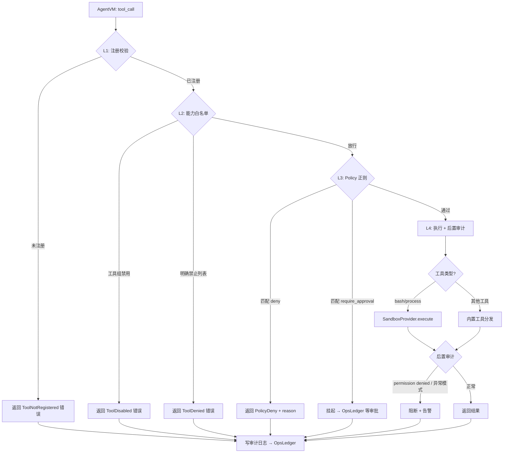

# ToolRegistry 四层审计链编码规格书

> **文档版本**：v1.0 | **最后更新**：2026-03-31
> **作者**：Architect (系统架构师)
> **依赖**：SDD v2.1 §3.3、SandboxProvider_Design.md v1.0
> **目标文件**：`src/tool_registry.py`（本文件）、`src/sandbox.py`（见 SandboxProvider_Design.md）

---

## 1. 设计目标

`ToolRegistry` 是 AgentVM 与所有工具之间的唯一网关。每一次 tool_call 必须经过完整的 **四层审计链**（L1→L2→L3→L4），任何层拦截即终止执行。

**关键约束**：
- 审计链不可绕过，AgentVM **禁止直接调用** subprocess/sandbox，必须经过 ToolRegistry.dispatch()
- 所有审计结果（pass/deny/require_approval/error）均写回 OpsLedger
- `command_execution` 组工具（bash/process）的实际执行委托给 SandboxProvider

---

## 2. 审计链流程图



---

## 3. 类型定义

```python
from __future__ import annotations

import abc
import json
import re
import time
from dataclasses import dataclass, field
from enum import Enum
from pathlib import Path
from typing import Any, Callable, Awaitable

from src.ops_ledger import OpsLedger
from src.sandbox import SandboxProvider, SandboxResult


# ──────────────────── 枚举与常量 ────────────────────

class AuditVerdict(str, Enum):
    """审计决策"""
    PASS = "pass"
    DENY = "deny"
    DISABLED = "disabled"
    NOT_REGISTERED = "not_registered"
    REQUIRE_APPROVAL = "require_approval"
    POST_AUDIT_BLOCK = "post_audit_block"
    ERROR = "error"


# ──────────────────── 数据结构 ────────────────────

@dataclass(slots=True)
class PolicyRule:
    """单条 Policy 规则（从 policy-default.jsonl 加载）"""
    level: str              # "L1" | "L2" | "L3"
    effect: str             # "deny" | "allow" | "require_approval"
    match: dict[str, str]   # command_regex / node_role+path_prefix / path_regex
    reason: str


@dataclass(slots=True)
class AuditRecord:
    """审计日志记录，最终写入 OpsLedger"""
    tool_name: str
    agent_did: str
    verdict: AuditVerdict
    layer: str                          # "L1" | "L2" | "L3" | "L4"
    reason: str = ""
    command: str | None = None          # bash/process 命令内容
    exit_code: int | None = None
    duration_ms: int | None = None
    ts: int = field(default_factory=lambda: int(time.time() * 1000))

    def to_dict(self) -> dict[str, Any]:
        d = {
            "type": "tool_audit",
            "tool_name": self.tool_name,
            "agent_did": self.agent_did,
            "verdict": self.verdict.value,
            "layer": self.layer,
            "reason": self.reason,
            "ts": self.ts,
        }
        if self.command is not None:
            d["command"] = self.command
        if self.exit_code is not None:
            d["exit_code"] = self.exit_code
        if self.duration_ms is not None:
            d["duration_ms"] = self.duration_ms
        return d


@dataclass(slots=True)
class ToolCallResult:
    """ToolRegistry.dispatch 统一返回类型"""
    success: bool
    verdict: AuditVerdict
    data: dict[str, Any] = field(default_factory=dict)
    error: str = ""
```

---

## 4. ToolRegistry 主体结构

```python
class ToolRegistry:
    """工具注册与四层审计网关"""

    # ── 已注册工具名 → 工具组名 的反向映射 ──
    _TOOL_TO_GROUP: dict[str, str]  # 构造时从 DEFAULT_TOOL_GROUPS 反转生成

    # ── 需要经过 SandboxProvider 的工具 ──
    _SANDBOX_TOOLS: frozenset[str] = frozenset({"bash", "process"})

    # ── 后置审计敏感关键词（stderr 检测） ──
    _POST_AUDIT_PATTERNS: list[re.Pattern] = [
        re.compile(r"permission denied", re.IGNORECASE),
        re.compile(r"operation not permitted", re.IGNORECASE),
        re.compile(r"access denied", re.IGNORECASE),
        re.compile(r"authentication fail", re.IGNORECASE),
    ]

    def __init__(
        self,
        *,
        sandbox: SandboxProvider,
        ops_ledger: OpsLedger,
        policy_path: str | Path = "config/policy-default.jsonl",
        tool_handlers: dict[str, Callable[..., Awaitable[dict]]] | None = None,
    ):
        """
        Parameters
        ----------
        sandbox : SandboxProvider
            由 create_sandbox_provider() 工厂创建
        ops_ledger : OpsLedger
            审计日志写入目标
        policy_path : str | Path
            Policy 规则文件路径
        tool_handlers : dict | None
            非 bash/process 工具的处理函数映射
            key = tool_name, value = async def handler(args) -> dict
        """
        self._sandbox = sandbox
        self._ledger = ops_ledger
        self._policies = self._load_policies(Path(policy_path))
        self._handlers = tool_handlers or {}

        # 构建 tool → group 反向映射
        self._TOOL_TO_GROUP = {}
        for group, tools in DEFAULT_TOOL_GROUPS.items():
            for tool in tools:
                self._TOOL_TO_GROUP[tool] = group

    # ══════════════════════════════════════════════
    #  核心入口：dispatch
    # ══════════════════════════════════════════════

    async def dispatch(
        self,
        tool_name: str,
        args: dict[str, Any],
        *,
        agent_did: str = "",
        agent_tools: dict[str, bool] | None = None,
        node_role: str = "",
    ) -> ToolCallResult:
        """
        四层审计 + 执行。

        Parameters
        ----------
        tool_name : str
            工具名（如 "bash", "read", "mcp_call"）
        args : dict
            工具参数
        agent_did : str
            调用方 Agent 的 DID（用于审计记录）
        agent_tools : dict | None
            Agent 的工具组启用配置（从 agent_config.json 加载）
            None 表示使用默认全开配置
        node_role : str
            当前节点角色（"web" / "db" / ""），用于 L2 Policy 匹配
        """
        effective_tools = agent_tools or dict(DEFAULT_TOOL_ENABLEMENT)

        # ──── L1: 注册校验 ────
        result = self._check_l1_registration(tool_name, agent_did)
        if result is not None:
            return result

        # ──── L2: 能力白名单 ────
        result = self._check_l2_capability(tool_name, agent_did, effective_tools)
        if result is not None:
            return result

        # ──── L3: Policy 正则 ────
        if tool_name in self._SANDBOX_TOOLS:
            command = args.get("command", "")
            result = self._check_l3_policy(tool_name, command, agent_did, node_role)
            if result is not None:
                return result

        # ──── L4: 执行 + 后置审计 ────
        return await self._execute_l4(tool_name, args, agent_did)
```

---

## 5. 各层实现规格

### 5.1 L1 — 注册校验

```python
def _check_l1_registration(self, tool_name: str, agent_did: str) -> ToolCallResult | None:
    """
    检查工具名是否在已注册列表中（DEFAULT_TOOL_GROUPS 的所有 value 展开）。

    规则：
    - 如果 tool_name 不在 _TOOL_TO_GROUP 中 → NOT_REGISTERED
    - 如果 tool_name 在 DEFAULT_DENIED_TOOLS 中 → 也视为未注册（deny）

    返回 None 表示通过，返回 ToolCallResult 表示拦截。
    """
    all_known = set(self._TOOL_TO_GROUP.keys())
    denied = set(DEFAULT_DENIED_TOOLS)

    if tool_name not in all_known or tool_name in denied:
        record = AuditRecord(
            tool_name=tool_name,
            agent_did=agent_did,
            verdict=AuditVerdict.NOT_REGISTERED,
            layer="L1",
            reason=f"tool '{tool_name}' is not registered or explicitly denied",
        )
        self._write_audit(record)
        return ToolCallResult(
            success=False,
            verdict=AuditVerdict.NOT_REGISTERED,
            error=record.reason,
        )
    return None
```

### 5.2 L2 — 能力白名单

```python
def _check_l2_capability(
    self, tool_name: str, agent_did: str, agent_tools: dict[str, bool]
) -> ToolCallResult | None:
    """
    检查 Agent 的 tool-registry.jsonc 是否启用了该工具所属的工具组。

    规则：
    - tool_name → 查 _TOOL_TO_GROUP → 得到 group_name
    - 如果 agent_tools[group_name] == False → DISABLED
    """
    group = self._TOOL_TO_GROUP.get(tool_name)
    if group and not agent_tools.get(group, False):
        record = AuditRecord(
            tool_name=tool_name,
            agent_did=agent_did,
            verdict=AuditVerdict.DISABLED,
            layer="L2",
            reason=f"tool group '{group}' is disabled for agent '{agent_did}'",
        )
        self._write_audit(record)
        return ToolCallResult(
            success=False,
            verdict=AuditVerdict.DISABLED,
            error=record.reason,
        )
    return None
```

### 5.3 L3 — Policy 正则（⚠️ 关键复杂逻辑）

```python
def _check_l3_policy(
    self, tool_name: str, command: str, agent_did: str, node_role: str
) -> ToolCallResult | None:
    """
    三阶段 Policy 评估（SDD §3.3 约定）：

    Phase 1: 遍历所有 L1 deny 规则
        → 命中 command_regex → 立即 DENY（不可被 L2 allow 覆盖）

    Phase 2: 遍历所有 L2 allow 规则
        → 命中 node_role + path_prefix → 放行（跳过 L3 require_approval）

    Phase 3: 遍历所有 L3 require_approval 规则
        → 命中 path_regex → 挂起等待审批

    全部不命中 → 放行
    """
    # ── Phase 1: L1 deny ──
    for rule in self._policies:
        if rule.level == "L1" and rule.effect == "deny":
            regex = rule.match.get("command_regex", "")
            if regex and re.search(regex, command):
                record = AuditRecord(
                    tool_name=tool_name,
                    agent_did=agent_did,
                    verdict=AuditVerdict.DENY,
                    layer="L3",
                    reason=rule.reason,
                    command=command,
                )
                self._write_audit(record)
                return ToolCallResult(
                    success=False,
                    verdict=AuditVerdict.DENY,
                    error=f"Policy L1 deny: {rule.reason}",
                )

    # ── Phase 2: L2 allow ──
    for rule in self._policies:
        if rule.level == "L2" and rule.effect == "allow":
            rule_role = rule.match.get("node_role", "")
            rule_prefix = rule.match.get("path_prefix", "")
            if rule_role and rule_role == node_role and rule_prefix and rule_prefix in command:
                # 明确放行，跳过 L3 检查
                return None

    # ── Phase 3: L3 require_approval ──
    for rule in self._policies:
        if rule.level == "L3" and rule.effect == "require_approval":
            path_regex = rule.match.get("path_regex", "")
            if path_regex and re.search(path_regex, command):
                # 创建 OpsLedger 审批条目
                entry_id = self._ledger.create_entry(
                    action="approval_required",
                    metadata={
                        "tool_name": tool_name,
                        "command": command,
                        "agent_did": agent_did,
                        "reason": rule.reason,
                    },
                )
                record = AuditRecord(
                    tool_name=tool_name,
                    agent_did=agent_did,
                    verdict=AuditVerdict.REQUIRE_APPROVAL,
                    layer="L3",
                    reason=rule.reason,
                    command=command,
                )
                self._write_audit(record)
                return ToolCallResult(
                    success=False,
                    verdict=AuditVerdict.REQUIRE_APPROVAL,
                    data={"pending_approval_id": entry_id},
                    error=f"Requires approval: {rule.reason}",
                )

    return None  # 全部通过
```

### 5.4 L4 — 执行 + 后置审计

```python
async def _execute_l4(
    self, tool_name: str, args: dict[str, Any], agent_did: str
) -> ToolCallResult:
    """
    L4 实际执行 + 后置审计。

    分两条路径：
    1. bash/process → SandboxProvider.execute()
    2. 其他工具 → _handlers[tool_name](args)

    后置审计检测：
    - stderr 中包含 permission denied / access denied → POST_AUDIT_BLOCK
    - exit_code != 0 → 记录但不阻断（运维场景下 exit_code 非 0 是正常诊断结果）
    """
    try:
        if tool_name in self._SANDBOX_TOOLS:
            return await self._execute_sandbox(tool_name, args, agent_did)
        else:
            return await self._execute_builtin(tool_name, args, agent_did)
    except Exception as exc:
        record = AuditRecord(
            tool_name=tool_name,
            agent_did=agent_did,
            verdict=AuditVerdict.ERROR,
            layer="L4",
            reason=f"execution error: {exc!r}",
        )
        self._write_audit(record)
        return ToolCallResult(
            success=False,
            verdict=AuditVerdict.ERROR,
            error=str(exc),
        )


async def _execute_sandbox(
    self, tool_name: str, args: dict[str, Any], agent_did: str
) -> ToolCallResult:
    """bash/process 命令经由 SandboxProvider 执行"""
    command = args.get("command", "")
    timeout = args.get("timeout", 30)
    workdir = args.get("workdir")

    result: SandboxResult = await self._sandbox.execute(
        command=command,
        timeout_seconds=timeout,
        workdir=workdir,
    )

    # ── 后置审计：敏感模式检测 ──
    verdict = AuditVerdict.PASS
    block_reason = ""
    for pattern in self._POST_AUDIT_PATTERNS:
        if pattern.search(result.stderr):
            verdict = AuditVerdict.POST_AUDIT_BLOCK
            block_reason = f"post-audit blocked: stderr contains '{pattern.pattern}'"
            break

    record = AuditRecord(
        tool_name=tool_name,
        agent_did=agent_did,
        verdict=verdict,
        layer="L4",
        reason=block_reason or "executed successfully",
        command=command,
        exit_code=result.exit_code,
        duration_ms=result.duration_ms,
    )
    self._write_audit(record)

    if verdict == AuditVerdict.POST_AUDIT_BLOCK:
        return ToolCallResult(
            success=False,
            verdict=verdict,
            error=block_reason,
            data={
                "exit_code": result.exit_code,
                "stderr": result.stderr[:500],  # 截断避免泄露
            },
        )

    return ToolCallResult(
        success=True,
        verdict=AuditVerdict.PASS,
        data={
            "stdout": result.stdout,
            "stderr": result.stderr,
            "exit_code": result.exit_code,
            "duration_ms": result.duration_ms,
            "truncated": result.truncated,
        },
    )


async def _execute_builtin(
    self, tool_name: str, args: dict[str, Any], agent_did: str
) -> ToolCallResult:
    """非 sandbox 工具分发"""
    handler = self._handlers.get(tool_name)
    if handler is None:
        # 工具已注册但无 handler（Phase 2 占位，后续模块实现）
        record = AuditRecord(
            tool_name=tool_name,
            agent_did=agent_did,
            verdict=AuditVerdict.ERROR,
            layer="L4",
            reason=f"no handler registered for tool '{tool_name}'",
        )
        self._write_audit(record)
        return ToolCallResult(
            success=False,
            verdict=AuditVerdict.ERROR,
            error=f"tool '{tool_name}' handler not implemented",
        )

    result_data = await handler(args)

    record = AuditRecord(
        tool_name=tool_name,
        agent_did=agent_did,
        verdict=AuditVerdict.PASS,
        layer="L4",
        reason="executed successfully",
    )
    self._write_audit(record)
    return ToolCallResult(success=True, verdict=AuditVerdict.PASS, data=result_data)
```

---

## 6. 辅助方法

```python
# ──────────────────── Policy 加载 ────────────────────

@staticmethod
def _load_policies(path: Path) -> list[PolicyRule]:
    """
    从 JSONL 文件逐行解析 Policy 规则。
    空行和 '#' 开头的注释行跳过。
    """
    rules: list[PolicyRule] = []
    if not path.exists():
        return rules
    for line in path.read_text(encoding="utf-8").splitlines():
        line = line.strip()
        if not line or line.startswith("#"):
            continue
        obj = json.loads(line)
        rules.append(PolicyRule(
            level=obj["level"],
            effect=obj["effect"],
            match=obj["match"],
            reason=obj["reason"],
        ))
    return rules


# ──────────────────── 审计日志写入 ────────────────────

def _write_audit(self, record: AuditRecord) -> None:
    """将审计记录写入 OpsLedger"""
    self._ledger.create_entry(
        action="tool_audit",
        metadata=record.to_dict(),
    )
```

---

## 7. OpsLedger 接口适配说明

当前 Phase 1 的 `OpsLedger.create_entry()` 签名如下（`src/ops_ledger.py` 实际代码）：

```python
def create_entry(self, *, action: str, metadata: dict | None = None, ...) -> str:
```

`ToolRegistry` 调用 `self._ledger.create_entry()` 时：
- `action` 传固定字符串 `"tool_audit"` 或 `"approval_required"`
- `metadata` 传 `AuditRecord.to_dict()` 或自定义 dict
- 返回值为 entry_id（字符串）

> ⚠️ **如果 OpsLedger 现有接口与上述不完全匹配**，Developer 需要在 `ops_ledger.py` 中新增一个薄封装方法（如 `log_audit()`），而非修改 Phase 1 已测试通过的核心逻辑。

---

## 8. 与 AgentVM 的集成约定

AgentVM 调用 ToolRegistry 的唯一入口：

```python
# src/agent_vm.py 中（伪代码）
result = await self._tool_registry.dispatch(
    tool_name=tc["name"],
    args=json.loads(tc["arguments"]),
    agent_did=self._current_agent.did,
    agent_tools=self._current_agent.tools,
    node_role=self._node_role,
)

if not result.success:
    if result.verdict == AuditVerdict.REQUIRE_APPROVAL:
        # 告知 LLM 需要人工审批
        observation = f"⚠️ 命令已挂起等待审批：{result.error}"
    else:
        observation = f"❌ 工具调用被拒绝：{result.error}"
else:
    observation = json.dumps(result.data, ensure_ascii=False)

# 将 observation 注入 Think-Act-Observe 回路
```

---

## 9. 监控检查清单（Architect 持续审视）

Developer 编码时，以下 **7 个审计完整性断点** 必须全部满足，否则打回重做：

| # | 检查项 | 验证方式 |
|---|---|---|
| **C-1** | L1 注册校验必须检查 `DEFAULT_DENIED_TOOLS` | `test_l1_denied_tool()` |
| **C-2** | L2 能力白名单必须读取 Agent 级别的 `tools` 配置，非全局默认 | `test_l2_per_agent_config()` |
| **C-3** | L3 Policy 评估必须按 L1→L2→L3 优先级遍历，L1 deny 不可被 L2 allow 覆盖 | `test_l3_l1_priority_over_l2()` |
| **C-4** | L3 require_approval 必须写 OpsLedger 并返回 entry_id | `test_l3_approval_creates_ledger_entry()` |
| **C-5** | L4 后置审计必须检测 stderr 中的 permission denied 等模式 | `test_l4_post_audit_permission_denied()` |
| **C-6** | 所有审计路径（pass/deny/disabled/error）均必须调用 `_write_audit()` | 代码审查 + 覆盖率 |
| **C-7** | dispatch() 返回 `ToolCallResult`，不抛异常（异常在内部 catch 后转为 ERROR verdict） | `test_dispatch_never_raises()` |

---

## 10. 文件交付清单

| 文件 | 内容 | 约束 |
|---|---|---|
| `src/tool_registry.py` | ToolRegistry 类 + 类型定义 + Policy 加载 | 必须 import sandbox.py 和 ops_ledger.py |
| `src/sandbox.py` | SandboxProvider + DirectRunner + NsJailRunner + BubblewrapRunner | 见 SandboxProvider_Design.md |
| `tests/test_sandbox.py` | Sandbox 单元测试 | 见 SandboxProvider_Design.md §8 |
| `tests/test_tool_registry.py` | 四层审计链测试（至少覆盖 C-1 到 C-7） | 见本文档 §9 |

---

## 11. Developer 编码约束（红线）

1. `ToolRegistry` 类必须在 `src/tool_registry.py` 单文件内，包含所有类型定义
2. `dispatch()` 必须是 `async def`，与 AgentVM 异步调用链一致
3. `dispatch()` 禁止抛出任何未捕获异常，所有错误必须转为 `ToolCallResult(success=False, ...)`
4. Policy 规则加载发生在 `__init__` 阶段，运行时不重新读取文件（热重载留给 Phase 3）
5. `_TOOL_TO_GROUP` 反向映射在 `__init__` 时一次性构建，不在每次 dispatch 中重建
6. 后置审计的 `_POST_AUDIT_PATTERNS` 为类变量，可扩展但不可在 dispatch 内硬编码
7. `_write_audit()` 调用 OpsLedger 时如果写入失败，**不能阻断主流程**，用 `try-except` 捕获并 log 到 stderr
8. Windows 环境下 `DirectRunner` 的 `SIGTERM` 不可用，必须直接调用 `proc.kill()`（已在 SandboxProvider_Design.md 中约定）
